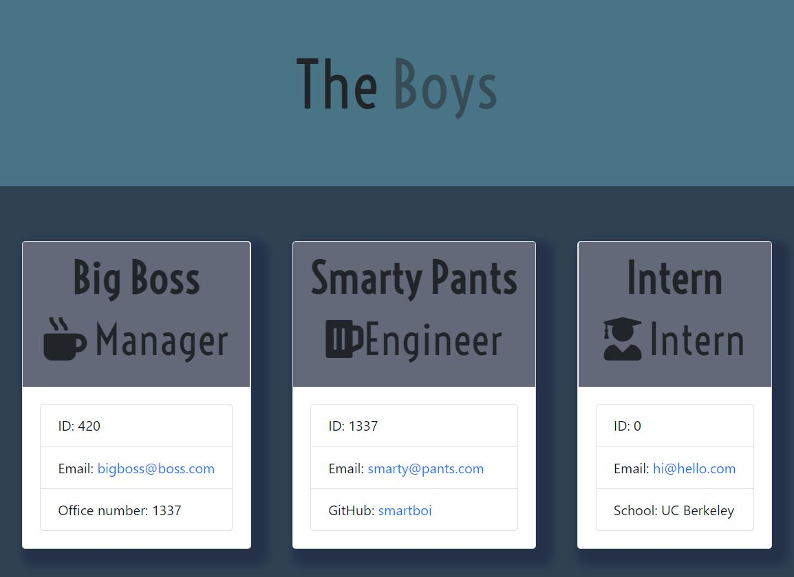

  # README Generator
  

  A command-line based application that generates a quick yet professional Team Roster from a users input. This helps save precious time that could be better allocated to developing an application.

  ## Installation

  1. Clone this repository
  2. Node.js should be installed before running this application.
  3. `npm install` or `npm i` required.
  
  ## Usage

  * To invoke this application use the command:

    `npm run start`

  * You will then be prompted with questions to create a pro Team Roster.
  
  * Once all prompts have been completed, each employee card should contain:
    * ID Number
    * Email
    * Office Number/ Github/ School

    

    * [Video Demo](https://drive.google.com/file/d/1ClmS3jqAvl9rUJ2rTpP0OZuGOvGprjtb/view?usp=sharing)

    ## Features

    * Javascript
    * Node.js
    * npm

    ## License

    Copyright (c) BoiledLettuce. All rights reserved.